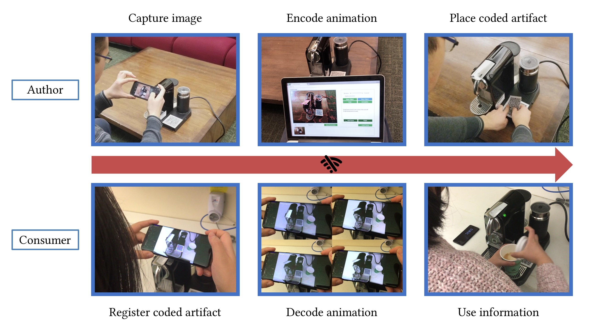

# AniCode: Authoring Coded Artifacts for Network-Free Personalized Animations

Zeyu Wang*, Shiyu Qiu*, Qingyang Chen, Natallia Trayan, Alexander Ringlein, Julie Dorsey, and Holly Rushmeier

Yale University

Published in the Visual Computer and presented at Computer Graphics International 2019 [[pdf]](https://graphics.cs.yale.edu/sites/default/files/wang2019_article_anicodeauthoringcodedartifacts.pdf)

This repository contains source code of AniCode's [authoring interface](./AuthoringInterface) and [client application](./AniCodeClient).

You can download the Client APP from [Release](https://github.com/CISLab-HKUST/AniCode/releases/tag/1.0.0).

A live demo is available at https://cislab.hkust-gz.edu.cn/projects/anicode/.
